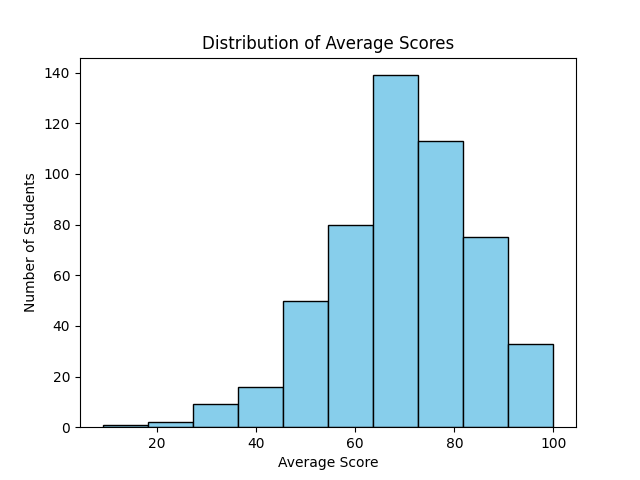
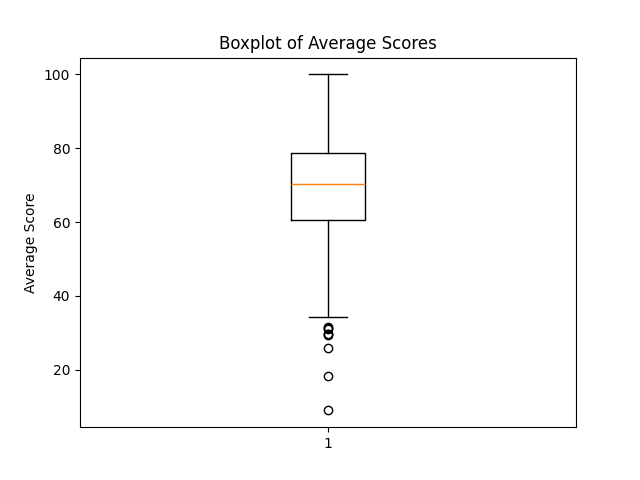
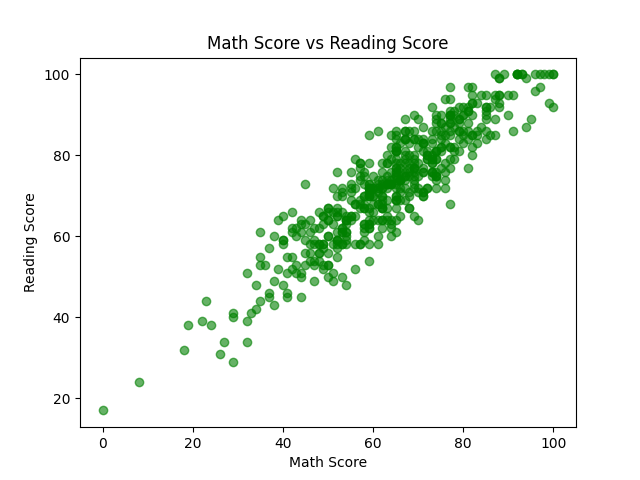

# 📊 Student Performance Dashboard

## 📌 Overview
This project provides an **interactive dashboard** to analyze student academic performance using Python and Streamlit.  
It visualizes trends across subjects and highlights patterns in student achievement.

---

## 🎯 Objectives
- Calculate overall student performance
- Analyze score distribution across subjects
- Compare performance between genders
- Visualize insights using histograms, boxplots, and scatterplots

---

## 🛠️ Tools & Technologies
- Python  
- Pandas  
- Matplotlib  
- Streamlit  

---

## 📂 Dataset
The dataset contains student scores in:
- Math
- Reading
- Writing

---

## ⚙️ Features
- Created a new column: `average_score`  
- Filtered data by gender  
- Visualized average scores using:
  - Histogram  
  - Boxplot  
  - Scatterplot (Math vs Reading)  
- Saved visualizations for portfolio display  

---

## 📊 Sample Visualizations

  
  
  

---

## ▶️ How to Run

1. Clone the repository:

```bash
git clone <https://github.com/Tumi-Manamela/student-dashboard.git>
cd student-dashboard


